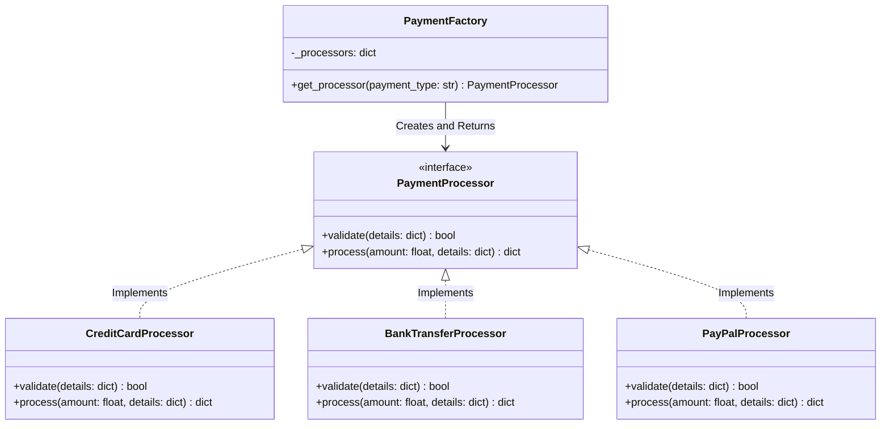

# OOP_DesignPatterns

```mermaid
classDiagram
    class PaymentProcessor {
        <<interface>>
        +validate(details: dict) bool
        +process(amount: float, details: dict) dict
    }
    class CreditCardProcessor {
        +validate(details: dict) bool
        +process(amount: float, details: dict) dict
    }
    class BankTransferProcessor {
        +validate(details: dict) bool
        +process(amount: float, details: dict) dict
    }
    class PayPalProcessor {
        +validate(details: dict) bool
        +process(amount: float, details: dict) dict
    }
    class PaymentFactory {
        -_processors: dict
        +get_processor(payment_type: str) PaymentProcessor
    }

    PaymentProcessor <|.. CreditCardProcessor : Implements
    PaymentProcessor <|.. BankTransferProcessor : Implements
    PaymentProcessor <|.. PayPalProcessor : Implements
    PaymentFactory --> PaymentProcessor : Creates and Returns
```
