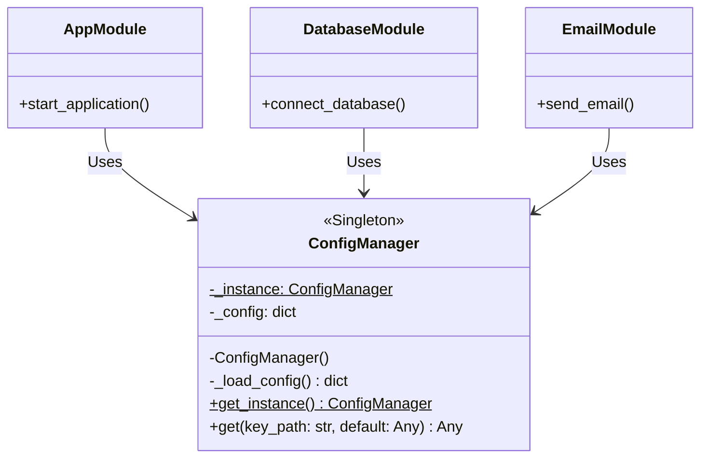

```mermaid

classDiagram
    class ConfigManager {
        <<Singleton>>
        -_instance: ConfigManager$
        -_config: dict
        -ConfigManager()
        -_load_config() dict
        +get_instance() ConfigManager$
        +get(key_path: str, default: Any) Any
    }

    class DatabaseModule {
        +connect_database()
    }
    class EmailModule {
        +send_email()
    }
    class AppModule {
        +start_application()
    }

    AppModule --> ConfigManager : Uses
    DatabaseModule --> ConfigManager : Uses
    EmailModule --> ConfigManager : Uses
```
