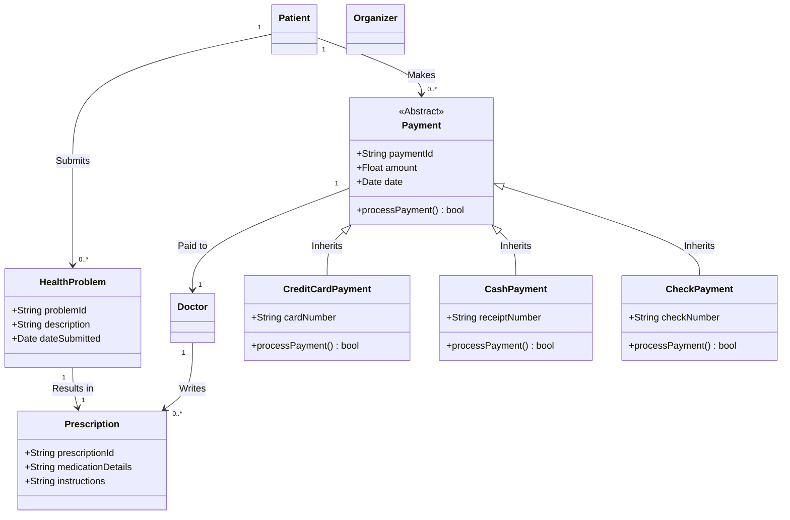
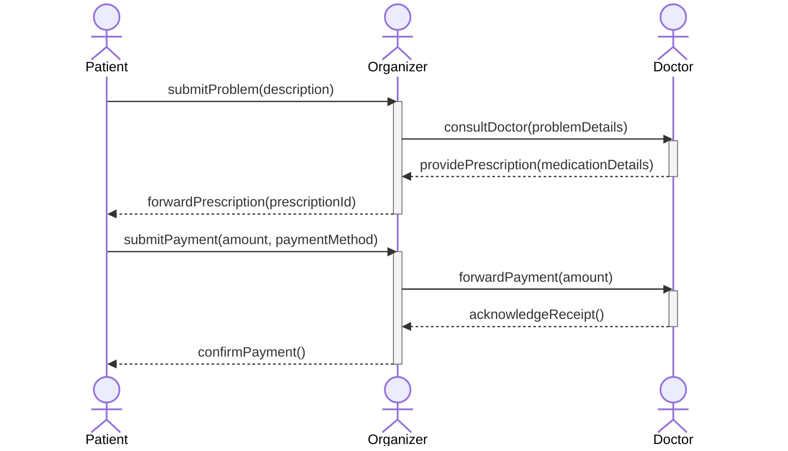

```mermaid
classDiagram
    class Patient
    class Organizer
    class Doctor
    
    class HealthProblem {
        +String problemId
        +String description
        +Date dateSubmitted
    }

    class Prescription {
        +String prescriptionId
        +String medicationDetails
        +String instructions
    }

    class Payment {
        <<Abstract>>
        +String paymentId
        +Float amount
        +Date date
        +processPayment() bool
    }

    class CreditCardPayment {
        +String cardNumber
        +processPayment() bool
    }

    class CashPayment {
        +String receiptNumber
        +processPayment() bool
    }

    class CheckPayment {
        +String checkNumber
        +processPayment() bool
    }

    Payment <|-- CreditCardPayment : Inherits
    Payment <|-- CashPayment : Inherits
    Payment <|-- CheckPayment : Inherits

    Patient "1" --> "0..*" HealthProblem : Submits
    HealthProblem "1" --> "1" Prescription : Results in
    Doctor "1" --> "0..*" Prescription : Writes
    Patient "1" --> "0..*" Payment : Makes
    Payment "1" --> "1" Doctor : Paid to

```

```mermaid
sequenceDiagram
    actor P as Patient
    actor O as Organizer
    actor D as Doctor

    P->>O: submitProblem(description)
    activate O
    O->>D: consultDoctor(problemDetails)
    activate D
    D-->>O: providePrescription(medicationDetails)
    deactivate D
    O-->>P: forwardPrescription(prescriptionId)
    deactivate O
    
    P->>O: submitPayment(amount, paymentMethod)
    activate O
    O->>D: forwardPayment(amount)
    activate D
    D-->>O: acknowledgeReceipt()
    deactivate D
    O-->>P: confirmPayment()
    deactivate O

```
