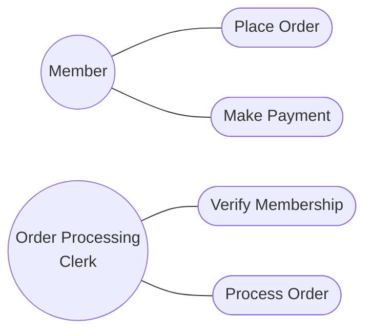
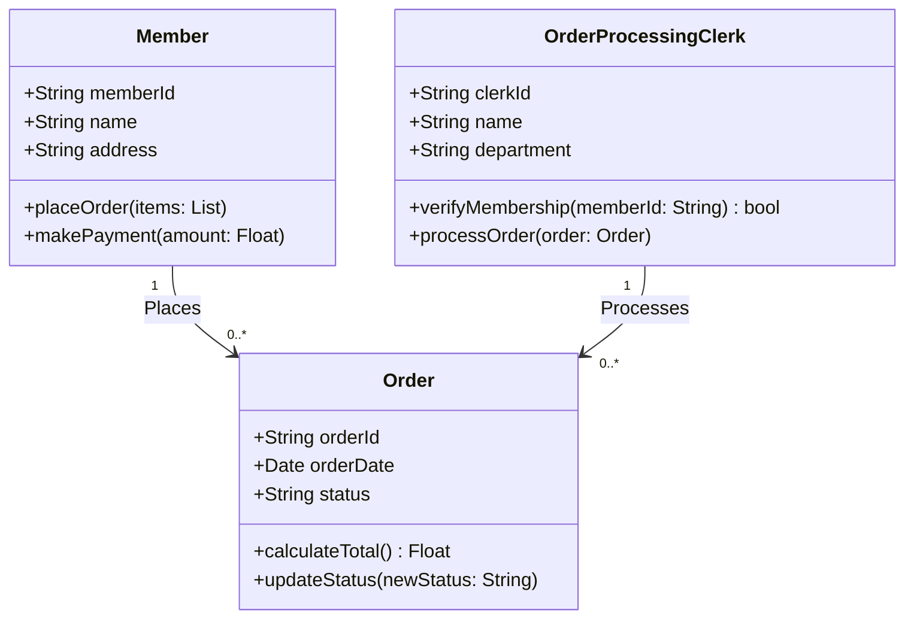

# Task 1.1: Use Case Diagram

```mermaid
flowchart LR
    %% Actors
    Member((Member))
    Clerk((Order Processing\nClerk))

    %% Use Cases
    PO([Place Order])
    VM([Verify Membership])
    ProcessO([Process Order])
    MP([Make Payment])

    %% Relationships
    Member --- PO
    Member --- MP
    
    Clerk --- VM
    Clerk --- ProcessO

```

# Task 1.2: Basic Class Diagram

```mermaid

classDiagram
    class Member {
        +String memberId
        +String name
        +String address
        +placeOrder(items: List)
        +makePayment(amount: Float)
    }

    class Order {
        +String orderId
        +Date orderDate
        +String status
        +calculateTotal() Float
        +updateStatus(newStatus: String)
    }

    class OrderProcessingClerk {
        +String clerkId
        +String name
        +String department
        +verifyMembership(memberId: String) bool
        +processOrder(order: Order)
    }

    Member "1" --> "0..*" Order : Places
    OrderProcessingClerk "1" --> "0..*" Order : Processes


```

